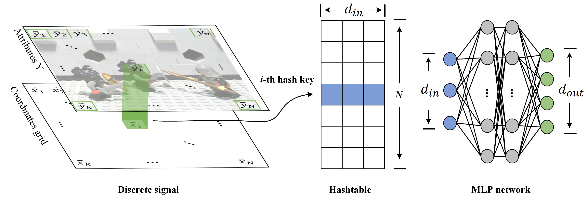
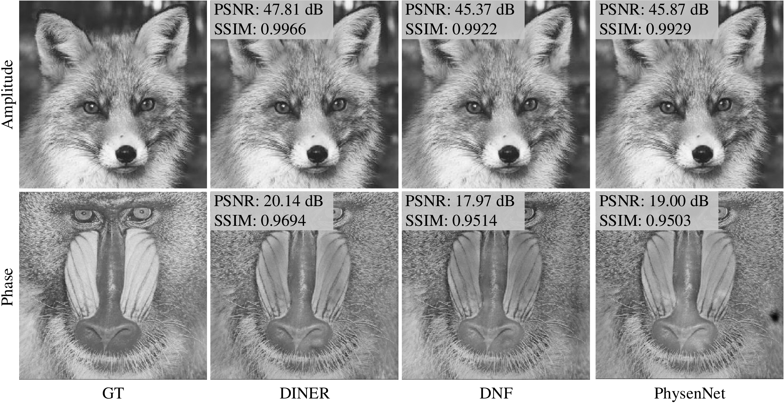

# 具有乱序不变性的隐式神经表示
# DINER:Disorder-Invariant Implicit Neural Representation

### 本期导读

隐式神经表示（INR）由于能将信号的属性值表现为相对应坐标的连续的可优化函数，从而成为了解决逆问题的强力武器。然而，隐式表示的基本结构（多层感知器）由于其内在的频谱偏差问题，即无法很好地学习高频信息，遏制了隐式表示的表达能力，因此限制了诸多逆问题求解的质量和速度。为此我们提出了乱序不变性的隐式神经表示法（DINER），在传统的INR之前加入了一个可学习的坐标映射，并将该映射存储到一个哈希表中。该坐标映射能将信号重新映射成一个后续INR网络更容易建模的分布，从而大大缓解频谱偏差问题。实验证明了DINER对于各种表示任务（图像、视频）和逆问题求解任务（无透镜成像、三维显微成像）都有很强的通用性，在质量和速度上也都优于目前最先进的算法。

### 技术路线

技术路线上，提出了新型的隐式神经表示，如图所示。该方法主要包含两个部分，哈希表模块和网络模块。对于需要表示的信号，我们将其划分为一个固定分辨率的网格，并将网格上的点按顺序映射到一张哈希表中去，哈希表中的参数设置为可学习。对于INR的主干部分，我们采取了轻量级的多层感知器（2层隐藏层，每一层的神经元数量为64）。

我们方法的乱序不变性体现在，对于具有相同的属性直方图和不同的空间分布的离散信号，哈希表可以将坐标投影到相同的分布上去，新的分布由于将相同属性值的点聚集到一起，从而使得信号的频率集中在低频，而这个简单的低频信号能够很好地被轻量级的多层感知器建模。

对于图像和视频的表示，我们的方法都能显示出信号的高频纹理细节。而其他的方法都在高频细节上表现欠佳。

对于逆问题求解，我们做了无透镜成像和三维显微成像的实验。在无透镜成像实验中，我们用DINER表示二维样本中的光场幅值和相位信息，通过光的衍射过程和传感器接收到的光强信息，根据计算得到的损失函数，逐步优化DINER中的参数。在得到训练好的隐式表达后，我们便可以恢复样本平面的幅值和相位信息。

在三维显微实验中，我们的隐式表达部分是三维样本的相对介电常数，根据相对介电常数，我们可以求得样本点的折射率，从而恢复出三维的空间成像。

### 简要小结

我们的研究工作使用了一种可学习的坐标变换，使信号的空间分布转变并集中在低频部分，从而使得INR的主干能够更加轻量化，加快信号的表示速度和能力。在无透镜成像和显微成像的实验中，我们的方法在质量和速度上都超过了其他的基于深度学习的方法。
